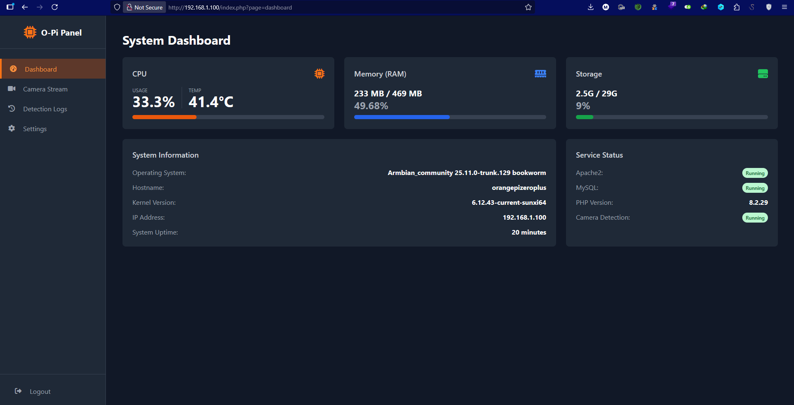

# Real Time Face Monitor: Real-Time Face Detection & Monitoring System

Real Time Face Monitor is a complete embedded surveillance and monitoring solution built on an Orange Pi. It captures and streams real-time video, performs on-device face detection using OpenCV, and logs every new face to a MySQL database. The entire system is managed through a sleek, real-time web dashboard that provides a live video feed, system health statistics, and remote configuration capabilities via a RESTful API.

---

## 🚀 Key Features

-   **Real-Time Video Streaming:** Low-latency camera stream accessible from the web dashboard.
-   **On-Device Face Detection:** Utilizes OpenCV to detect faces directly on the Orange Pi, drawing bounding boxes in real-time.
-   **MySQL Event Logging:** Captures an image of each new person detected and saves the filename and timestamp to a MySQL database for auditing.
-   **Web-Based Control Panel:** A full-stack dashboard to view the live stream and interact with the system.
-   **Live System Monitoring:** Displays real-time Orange Pi statistics, including CPU usage, memory load, and temperature.
-   **Remote Configuration:** Allows users to change system settings (e.g., detection sensitivity, stream resolution) on the fly via the web UI and a secure RESTful API.

---

## 🛠️ Tech Stack

| Category      | Technology                                    |
| ------------- | --------------------------------------------- |
| **Hardware** | Orange Pi, USB/CSI Camera                     |
| **OS** | Armbian / Debian-based Linux                  |
| **Backend** | Python, Flask, OpenCV, PHP             |
| **Frontend** | HTML5, CSS3, JavaScript  |
| **Database** | MySQL                                         |

---

## 🏗️ System Architecture

The system operates in a simple, robust loop:

1.  **Camera**: Captures the video feed.
2.  **Orange Pi (Backend Service)**:
    -   Reads the camera feed.
    -   Performs face detection using OpenCV.
    -   Streams the processed video feed to the web app.
    -   Saves images of new faces and logs metadata to the MySQL database.
    -   Exposes a REST API for status and configuration.
3.  **Web App (Frontend)**:
    -   Consumes the video stream and displays it.
    -   Periodically fetches system stats and logs from the API.
    -   Sends configuration changes back to the backend API.

---

## ⚙️ Setup and Installation

### Prerequisites

-   An Orange Pi (or similar single-board computer) with a Linux distribution installed.
-   A compatible USB or CSI camera.
-   MySQL Server installed and running.
-   Python 3.8+ and Node.js installed on the Orange Pi.

### 1. Hardware Setup

1.  Flash a Linux OS (like Armbian) onto an SD card and boot up your Orange Pi.
2.  Connect the camera and ensure it is detected by the OS (e.g., by checking `/dev/video0`).
